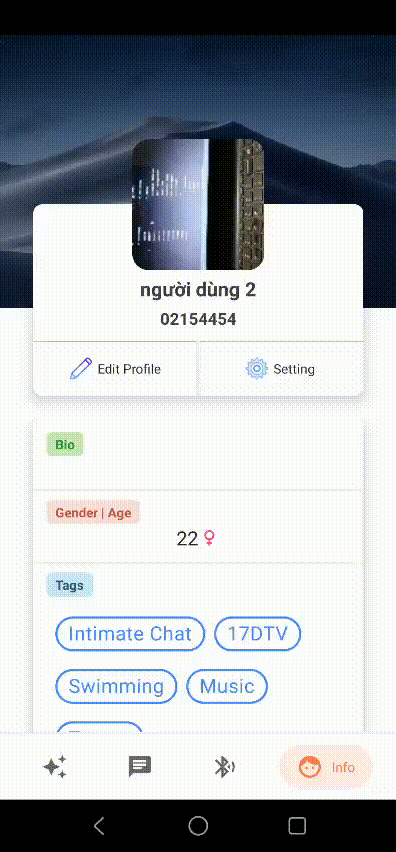

# K17-Android-Team7-BLE-Meet
I. main function:
  1. Discover user (demo).
  2. Scan bluetooth to find friend.
  3. chat (push notification when app killed).
  4. Change user's tags & images.

II. Demo
1. Demo 1: Register User
 

2. Demo 2: scan bluetooth connection

3. Demo 3: Log out and discover
 
